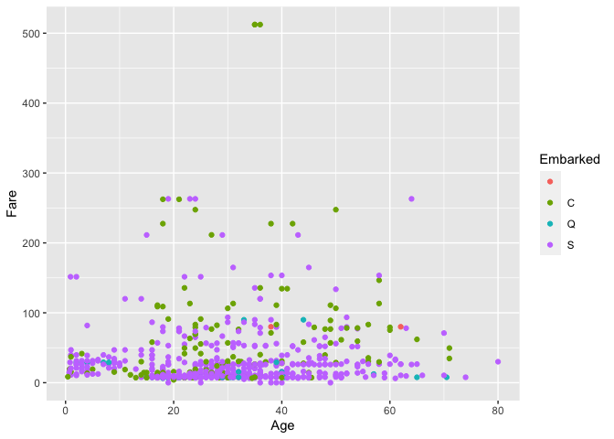
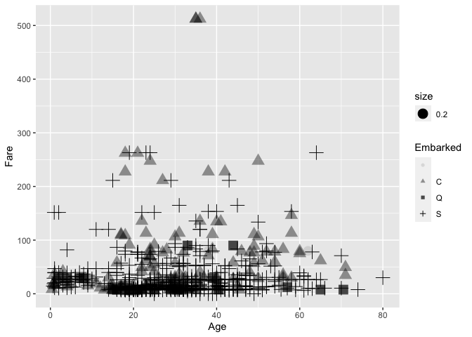
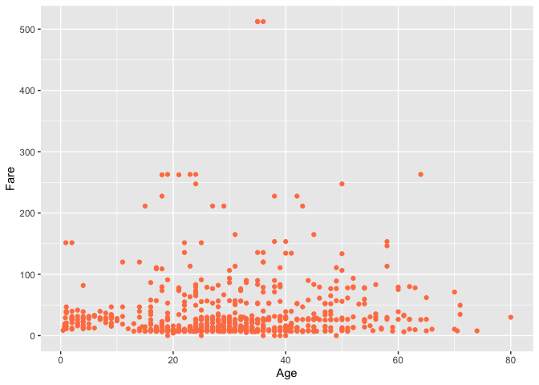
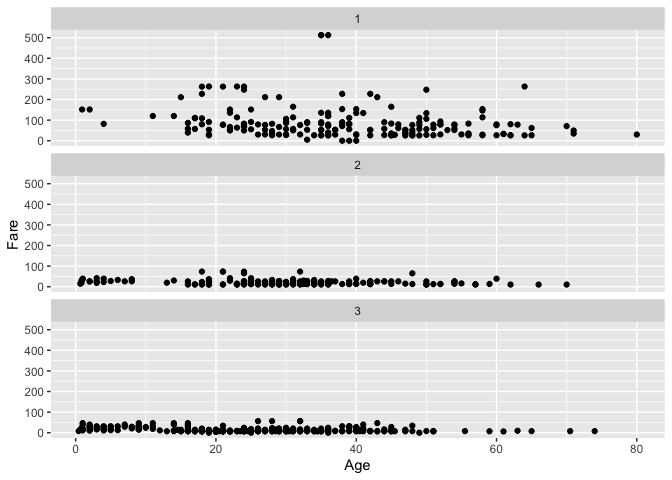
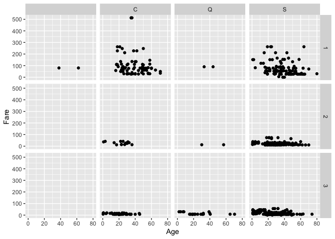
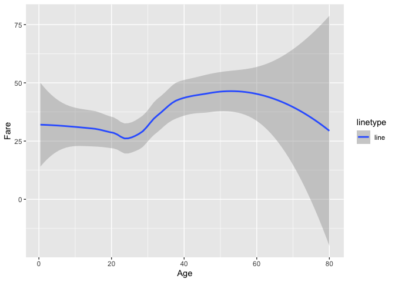
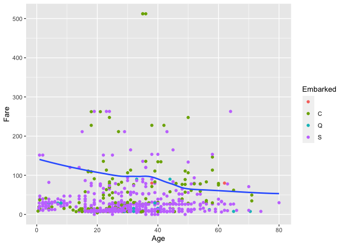
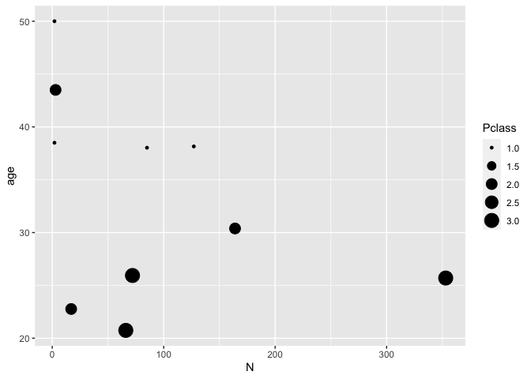

titanic\_prac
================

``` r
library(ggplot2)
```

    ## Registered S3 methods overwritten by 'tibble':
    ##   method     from  
    ##   format.tbl pillar
    ##   print.tbl  pillar

``` r
library(titanic)
library(dplyr)
```

    ## Warning: package 'dplyr' was built under R version 4.0.5

    ## 
    ## Attaching package: 'dplyr'

    ## The following objects are masked from 'package:stats':
    ## 
    ##     filter, lag

    ## The following objects are masked from 'package:base':
    ## 
    ##     intersect, setdiff, setequal, union

``` r
tit=titanic_train
head(tit)
```

    ##   PassengerId Survived Pclass
    ## 1           1        0      3
    ## 2           2        1      1
    ## 3           3        1      3
    ## 4           4        1      1
    ## 5           5        0      3
    ## 6           6        0      3
    ##                                                  Name    Sex Age SibSp Parch
    ## 1                             Braund, Mr. Owen Harris   male  22     1     0
    ## 2 Cumings, Mrs. John Bradley (Florence Briggs Thayer) female  38     1     0
    ## 3                              Heikkinen, Miss. Laina female  26     0     0
    ## 4        Futrelle, Mrs. Jacques Heath (Lily May Peel) female  35     1     0
    ## 5                            Allen, Mr. William Henry   male  35     0     0
    ## 6                                    Moran, Mr. James   male  NA     0     0
    ##             Ticket    Fare Cabin Embarked
    ## 1        A/5 21171  7.2500              S
    ## 2         PC 17599 71.2833   C85        C
    ## 3 STON/O2. 3101282  7.9250              S
    ## 4           113803 53.1000  C123        S
    ## 5           373450  8.0500              S
    ## 6           330877  8.4583              Q

``` r
ggplot(tit) +
  geom_point(mapping=aes(x=Age,y=Fare, color=Embarked))
```

<!-- -->

``` r
ggplot(tit) +
  geom_point(mapping=aes(x=Age,y=Fare, size=0.2, alpha=Embarked, shape=Embarked))
```

    ## Warning: Using alpha for a discrete variable is not advised.

    ## Warning: Removed 177 rows containing missing values (geom_point).

<!-- -->

``` r
ggplot(tit) +
  geom_point(mapping=aes(x=Age,y=Fare), color='coral')
```

    ## Warning: Removed 177 rows containing missing values (geom_point).

<!-- -->

``` r
ggplot(tit) +
  geom_point(mapping=aes(x=Age,y=Fare))+
  facet_wrap(~ Pclass, nrow=3)
```

    ## Warning: Removed 177 rows containing missing values (geom_point).

<!-- -->

``` r
ggplot(tit)+
  geom_point(mapping=aes(x=Age, y=Fare))+
  facet_grid(Pclass~ Embarked)
```

    ## Warning: Removed 177 rows containing missing values (geom_point).

<!-- -->

``` r
ggplot(tit)+
  geom_smooth(mapping=aes(x=Age, y=Fare,linetype='line'))
```

    ## `geom_smooth()` using method = 'loess' and formula 'y ~ x'

    ## Warning: Removed 177 rows containing non-finite values (stat_smooth).

<!-- -->

``` r
ggplot(tit, mapping=aes(x=Age, y=Fare))+
  geom_point(mapping=aes(color=Embarked))+
  geom_smooth(data=filter(tit, Pclass==1), se=FALSE)
```

    ## `geom_smooth()` using method = 'loess' and formula 'y ~ x'

    ## Warning: Removed 30 rows containing non-finite values (stat_smooth).

    ## Warning: Removed 177 rows containing missing values (geom_point).

<!-- -->

``` r
##filter 조건은 dpylr 패키지가 필요함
```

``` r
dat1<-filter(tit, Pclass==1)
head(select(dat1, Age, Pclass, Embarked))
```

    ##   Age Pclass Embarked
    ## 1  38      1        C
    ## 2  35      1        S
    ## 3  54      1        S
    ## 4  58      1        S
    ## 5  28      1        S
    ## 6  19      1        S

``` r
#Age:Embarked 혹은 -로 포함하지 않음을 표현
dat2<-mutate(dat1, birth=1900 + Age)
head(arrange(dat2, Age))
```

    ##   PassengerId Survived Pclass                                Name    Sex   Age
    ## 1         306        1      1      Allison, Master. Hudson Trevor   male  0.92
    ## 2         298        0      1        Allison, Miss. Helen Loraine female  2.00
    ## 3         446        1      1           Dodge, Master. Washington   male  4.00
    ## 4         803        1      1 Carter, Master. William Thornton II   male 11.00
    ## 5         436        1      1           Carter, Miss. Lucile Polk female 14.00
    ## 6         690        1      1   Madill, Miss. Georgette Alexandra female 15.00
    ##   SibSp Parch Ticket     Fare   Cabin Embarked   birth
    ## 1     1     2 113781 151.5500 C22 C26        S 1900.92
    ## 2     1     2 113781 151.5500 C22 C26        S 1902.00
    ## 3     0     2  33638  81.8583     A34        S 1904.00
    ## 4     1     2 113760 120.0000 B96 B98        S 1911.00
    ## 5     1     2 113760 120.0000 B96 B98        S 1914.00
    ## 6     0     1  24160 211.3375      B5        S 1915.00

``` r
#transmute는 사용되지 않은 변수를 모두 삭제한다
```

``` r
dat_group<-group_by(tit, Pclass, Embarked)
dat2<-summarize(dat_group,
          N=n(),
          age=mean(Age, na.rm=TRUE))
```

    ## `summarise()` has grouped output by 'Pclass'. You can override using the
    ## `.groups` argument.

``` r
ggplot(data=dat2, mapping=aes(x=N, y=age))+
  geom_point(aes(size=Pclass))
```

<!-- -->

``` r
dat_group<-tit %>%
  group_by(Pclass) %>%
  summarize(
          N=n() ,
          age=mean(Age, na.rm=TRUE)) %>%
ggplot(mapping=aes(x=N, y=age)) +
  geom_point(aes(color=Pclass))
```

### tidy data

``` r
x<-tribble( ~key, ~val_x,
            1, "x1",
            2, "x2",
            3, "x3")
y<-tribble( ~key, ~val_y,
            1, "y1",
            2, "y2",
            4, "y3")
inner_join(x,y,by="key")
```

    ## # A tibble: 2 x 3
    ##     key val_x val_y
    ##   <dbl> <chr> <chr>
    ## 1     1 x1    y1   
    ## 2     2 x2    y2

``` r
#semi_join, anti_join
```
