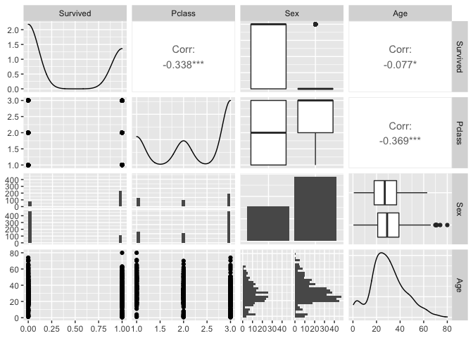
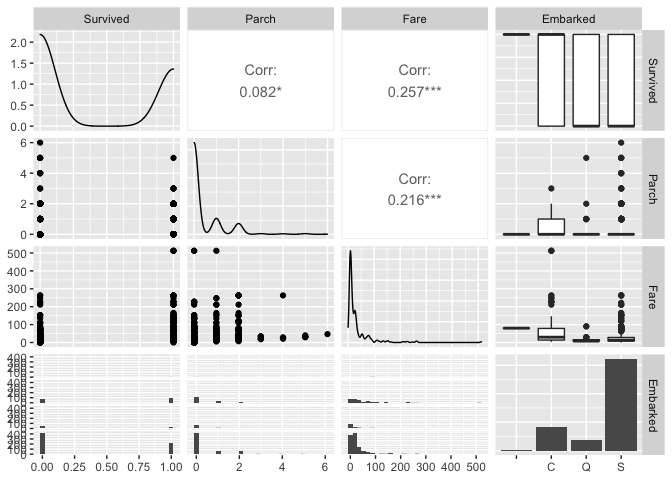
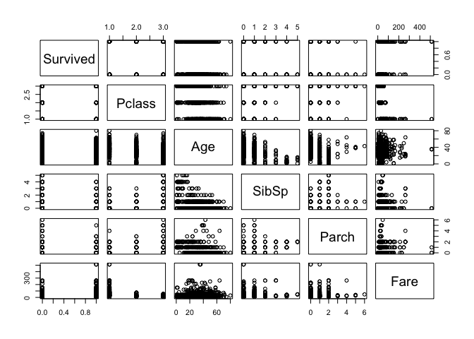
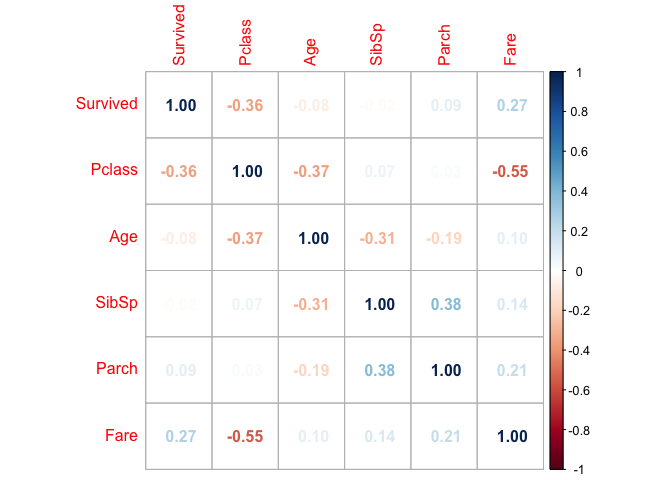

titanic\_regression
================

``` r
library(ggplot2)
```

    ## Registered S3 methods overwritten by 'tibble':
    ##   method     from  
    ##   format.tbl pillar
    ##   print.tbl  pillar

``` r
library(glmnet)
```

    ## Loading required package: Matrix

    ## Loaded glmnet 4.0-2

``` r
library(titanic)
library(GGally)
```

    ## Registered S3 method overwritten by 'GGally':
    ##   method from   
    ##   +.gg   ggplot2

``` r
data<-titanic_train
head(data)
```

    ##   PassengerId Survived Pclass
    ## 1           1        0      3
    ## 2           2        1      1
    ## 3           3        1      3
    ## 4           4        1      1
    ## 5           5        0      3
    ## 6           6        0      3
    ##                                                  Name    Sex Age SibSp Parch
    ## 1                             Braund, Mr. Owen Harris   male  22     1     0
    ## 2 Cumings, Mrs. John Bradley (Florence Briggs Thayer) female  38     1     0
    ## 3                              Heikkinen, Miss. Laina female  26     0     0
    ## 4        Futrelle, Mrs. Jacques Heath (Lily May Peel) female  35     1     0
    ## 5                            Allen, Mr. William Henry   male  35     0     0
    ## 6                                    Moran, Mr. James   male  NA     0     0
    ##             Ticket    Fare Cabin Embarked
    ## 1        A/5 21171  7.2500              S
    ## 2         PC 17599 71.2833   C85        C
    ## 3 STON/O2. 3101282  7.9250              S
    ## 4           113803 53.1000  C123        S
    ## 5           373450  8.0500              S
    ## 6           330877  8.4583              Q

``` r
ggpairs(data, columns=c(2,3,5,6))
```

    ## Warning in ggally_statistic(data = data, mapping = mapping, na.rm = na.rm, :
    ## Removed 177 rows containing missing values
    
    ## Warning in ggally_statistic(data = data, mapping = mapping, na.rm = na.rm, :
    ## Removed 177 rows containing missing values

    ## `stat_bin()` using `bins = 30`. Pick better value with `binwidth`.
    ## `stat_bin()` using `bins = 30`. Pick better value with `binwidth`.

    ## Warning: Removed 177 rows containing non-finite values (stat_boxplot).

    ## Warning: Removed 177 rows containing missing values (geom_point).
    
    ## Warning: Removed 177 rows containing missing values (geom_point).

    ## `stat_bin()` using `bins = 30`. Pick better value with `binwidth`.

    ## Warning: Removed 177 rows containing non-finite values (stat_bin).

    ## Warning: Removed 177 rows containing non-finite values (stat_density).

<!-- -->

``` r
ggpairs(data, columns=c(2,8,10,12))
```

    ## `stat_bin()` using `bins = 30`. Pick better value with `binwidth`.
    ## `stat_bin()` using `bins = 30`. Pick better value with `binwidth`.
    ## `stat_bin()` using `bins = 30`. Pick better value with `binwidth`.

<!-- -->

``` r
library(corrplot)
```

    ## corrplot 0.92 loaded

``` r
num_data<-data[,-c(1,4,5,9,11,12)]
head(num_data)
```

    ##   Survived Pclass Age SibSp Parch    Fare
    ## 1        0      3  22     1     0  7.2500
    ## 2        1      1  38     1     0 71.2833
    ## 3        1      3  26     0     0  7.9250
    ## 4        1      1  35     1     0 53.1000
    ## 5        0      3  35     0     0  8.0500
    ## 6        0      3  NA     0     0  8.4583

``` r
pairs(na.omit(num_data))
```

<!-- -->

``` r
corrplot(cor(na.omit(num_data)),method="number")
```

<!-- -->

``` r
cor.test(data$Survived, data$Pclass)
```

    ## 
    ##  Pearson's product-moment correlation
    ## 
    ## data:  data$Survived and data$Pclass
    ## t = -10.725, df = 889, p-value < 2.2e-16
    ## alternative hypothesis: true correlation is not equal to 0
    ## 95 percent confidence interval:
    ##  -0.3953692 -0.2790061
    ## sample estimates:
    ##       cor 
    ## -0.338481

``` r
cor.test(data$Survived, data$Age)
```

    ## 
    ##  Pearson's product-moment correlation
    ## 
    ## data:  data$Survived and data$Age
    ## t = -2.0667, df = 712, p-value = 0.03912
    ## alternative hypothesis: true correlation is not equal to 0
    ## 95 percent confidence interval:
    ##  -0.149744955 -0.003870727
    ## sample estimates:
    ##         cor 
    ## -0.07722109

``` r
num_data<-na.omit(num_data)
model1<-glm(Survived ~ Pclass+Age+SibSp+Parch+Fare, family=gaussian, data=num_data)
model_fit<-predict(model1,num_data)
summary(model1)
```

    ## 
    ## Call:
    ## glm(formula = Survived ~ Pclass + Age + SibSp + Parch + Fare, 
    ##     family = gaussian, data = num_data)
    ## 
    ## Deviance Residuals: 
    ##     Min       1Q   Median       3Q      Max  
    ## -1.0590  -0.3086  -0.1757   0.4111   1.0709  
    ## 
    ## Coefficients:
    ##               Estimate Std. Error t value Pr(>|t|)    
    ## (Intercept)  1.1936426  0.0890816  13.399  < 2e-16 ***
    ## Pclass      -0.2431795  0.0258320  -9.414  < 2e-16 ***
    ## Age         -0.0085767  0.0012971  -6.612 7.45e-11 ***
    ## SibSp       -0.0574653  0.0201147  -2.857   0.0044 ** 
    ## Parch        0.0491900  0.0215350   2.284   0.0227 *  
    ## Fare         0.0005591  0.0003939   1.419   0.1563    
    ## ---
    ## Signif. codes:  0 '***' 0.001 '**' 0.01 '*' 0.05 '.' 0.1 ' ' 1
    ## 
    ## (Dispersion parameter for gaussian family taken to be 0.1958669)
    ## 
    ##     Null deviance: 172.21  on 713  degrees of freedom
    ## Residual deviance: 138.67  on 708  degrees of freedom
    ## AIC: 870.17
    ## 
    ## Number of Fisher Scoring iterations: 2

``` r
model2<-glm(Survived ~ Pclass+Age+SibSp+Parch+Fare, family=binomial, data=num_data)
model2_fit<-predict(model2,num_data, type='response')
summary(model2)
```

    ## 
    ## Call:
    ## glm(formula = Survived ~ Pclass + Age + SibSp + Parch + Fare, 
    ##     family = binomial, data = num_data)
    ## 
    ## Deviance Residuals: 
    ##     Min       1Q   Median       3Q      Max  
    ## -2.4155  -0.8355  -0.6207   0.9942   2.4047  
    ## 
    ## Coefficients:
    ##              Estimate Std. Error z value Pr(>|z|)    
    ## (Intercept)  3.401026   0.505176   6.732 1.67e-11 ***
    ## Pclass      -1.153008   0.145943  -7.900 2.78e-15 ***
    ## Age         -0.044566   0.007210  -6.181 6.36e-10 ***
    ## SibSp       -0.292273   0.106079  -2.755  0.00586 ** 
    ## Parch        0.247881   0.109075   2.273  0.02305 *  
    ## Fare         0.003294   0.002537   1.299  0.19402    
    ## ---
    ## Signif. codes:  0 '***' 0.001 '**' 0.01 '*' 0.05 '.' 0.1 ' ' 1
    ## 
    ## (Dispersion parameter for binomial family taken to be 1)
    ## 
    ##     Null deviance: 964.52  on 713  degrees of freedom
    ## Residual deviance: 815.18  on 708  degrees of freedom
    ## AIC: 827.18
    ## 
    ## Number of Fisher Scoring iterations: 4

``` r
lambdas <- 10^seq(2, -3, by = -.1)
x<-as.matrix(num_data[,c(-1)])
y<-num_data$Survived
model3<-glmnet(x, y, family=gaussian, data=num_data, alpha=0)
summary(model3)
```

    ##           Length Class     Mode   
    ## a0        100    -none-    numeric
    ## beta      500    dgCMatrix S4     
    ## df        100    -none-    numeric
    ## dim         2    -none-    numeric
    ## lambda    100    -none-    numeric
    ## dev.ratio 100    -none-    numeric
    ## nulldev     1    -none-    numeric
    ## npasses     1    -none-    numeric
    ## jerr        1    -none-    numeric
    ## offset      1    -none-    logical
    ## call        6    -none-    call   
    ## family     11    family    list   
    ## nobs        1    -none-    numeric

``` r
cv_ridge <- cv.glmnet(x, y, alpha = 0)
optimal_lambda <- cv_ridge$lambda.min
optimal_lambda
```

    ## [1] 0.0176631

``` r
model3_fit <- predict(model3, s = optimal_lambda, newx = x)
```

``` r
model4<-glmnet(x, y, family=gaussian, data=num_data, alpha=1, lambda=lambdas, standardize = TRUE)
cv_lasso <- cv.glmnet(x, y, alpha = 1, lambda = lambdas)
optimal_lambda <- cv_lasso$lambda.min
optimal_lambda
```

    ## [1] 0.001

``` r
model4_fit <- predict(model4, s = optimal_lambda, newx = x)
```

``` r
model5<-glm(Survived ~ Pclass+Age+SibSp+Parch, family=binomial, data=num_data)
model5_fit<-predict(model5,num_data, type='response')
summary(model5)
```

    ## 
    ## Call:
    ## glm(formula = Survived ~ Pclass + Age + SibSp + Parch, family = binomial, 
    ##     data = num_data)
    ## 
    ## Deviance Residuals: 
    ##     Min       1Q   Median       3Q      Max  
    ## -2.3451  -0.8369  -0.6115   0.9829   2.4273  
    ## 
    ## Coefficients:
    ##              Estimate Std. Error z value Pr(>|z|)    
    ## (Intercept)  3.752019   0.437247   8.581  < 2e-16 ***
    ## Pclass      -1.266270   0.120874 -10.476  < 2e-16 ***
    ## Age         -0.045159   0.007192  -6.279 3.41e-10 ***
    ## SibSp       -0.273289   0.104373  -2.618  0.00883 ** 
    ## Parch        0.280807   0.105632   2.658  0.00785 ** 
    ## ---
    ## Signif. codes:  0 '***' 0.001 '**' 0.01 '*' 0.05 '.' 0.1 ' ' 1
    ## 
    ## (Dispersion parameter for binomial family taken to be 1)
    ## 
    ##     Null deviance: 964.52  on 713  degrees of freedom
    ## Residual deviance: 817.17  on 709  degrees of freedom
    ## AIC: 827.17
    ## 
    ## Number of Fisher Scoring iterations: 4

``` r
eval_results <- function(true, predicted) {
  SSE <- sum((predicted - true)^2)
  SST <- sum((true - mean(true))^2)
  R_square <- 1 - SSE / SST
  RMSE = sqrt(SSE/714)
data.frame(
  RMSE = RMSE,
  Rsquare = R_square
)
}

print(rbind(eval_results(y,model_fit),
        eval_results(y,model2_fit),
        eval_results(y,model3_fit),
        eval_results(y,model4_fit),
        eval_results(y,model5_fit)))
```

    ##        RMSE   Rsquare
    ## 1 0.4407051 0.1947536
    ## 2 0.4388281 0.2015983
    ## 3 0.4407437 0.1946127
    ## 4 0.4407133 0.1947238
    ## 5 0.4398557 0.1978549
