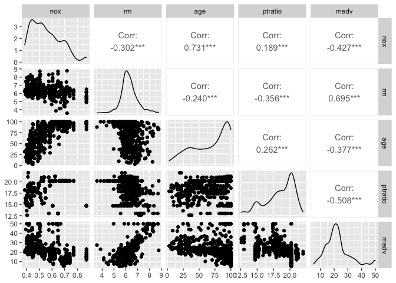
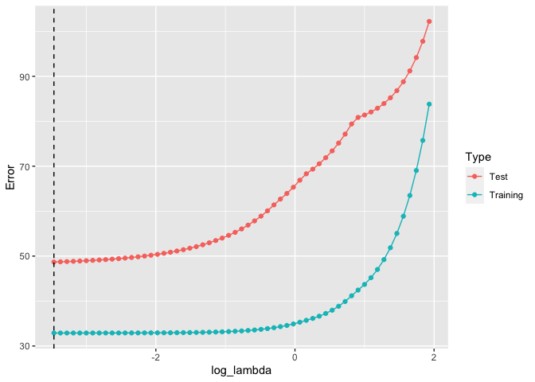
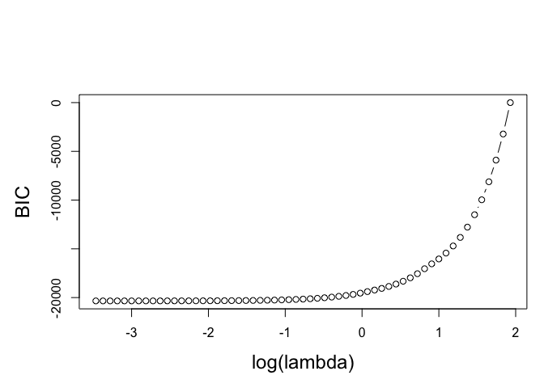
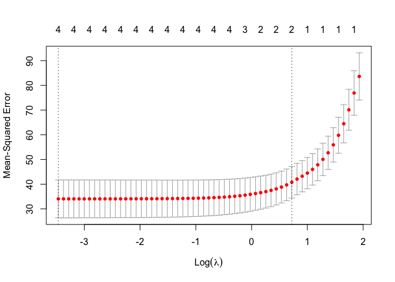

bostonhousing regression
================

## Boston Housing Regression

boston housing 데이터를 regression으로 적합시켜볼까 합니다요 데이터는 총 506개…좀 적다. 집값을 예상하는
데이터

``` r
library(mlbench)
library(dplyr)
```

    ## Warning: package 'dplyr' was built under R version 4.0.5

    ## Registered S3 methods overwritten by 'tibble':
    ##   method     from  
    ##   format.tbl pillar
    ##   print.tbl  pillar

    ## 
    ## Attaching package: 'dplyr'

    ## The following objects are masked from 'package:stats':
    ## 
    ##     filter, lag

    ## The following objects are masked from 'package:base':
    ## 
    ##     intersect, setdiff, setequal, union

``` r
library(ggplot2)
library(GGally)
```

    ## Registered S3 method overwritten by 'GGally':
    ##   method from   
    ##   +.gg   ggplot2

``` r
library(glmnet)
```

    ## Loading required package: Matrix

    ## Loaded glmnet 4.0-2

``` r
library(tidyr)
```

    ## 
    ## Attaching package: 'tidyr'

    ## The following objects are masked from 'package:Matrix':
    ## 
    ##     expand, pack, unpack

``` r
data("BostonHousing")
data<-select(BostonHousing, nox, rm, age, ptratio, medv)
head(data)
```

    ##     nox    rm  age ptratio medv
    ## 1 0.538 6.575 65.2    15.3 24.0
    ## 2 0.469 6.421 78.9    17.8 21.6
    ## 3 0.469 7.185 61.1    17.8 34.7
    ## 4 0.458 6.998 45.8    18.7 33.4
    ## 5 0.458 7.147 54.2    18.7 36.2
    ## 6 0.458 6.430 58.7    18.7 28.7

쓸 데이터만 따로 뽑아준다 오늘은 ML을 할건 아니라서…맨날 이렇게 야매로 데이터 분석을 하다 말아도 괜찮은가?대체 머신러닝은
언제하죠 라고 물으면…그러게 말이다

암튼…column을 살펴보면 nox: 10ppm당 농축 일산화 질소 rm: 주택 1가구 당 평균 방의 개수(당연히 연관이 높은
이유가 있었네…) age: 오래된 집의 비율 ptratio: 학생/교사의 비율 (이거 좀 재밌는듯) medv: 오늘의
response값

``` r
ggpairs(data)
```

<!-- -->

아니 이게 무슨 학생이 많을 수록 집 값이 싸다고? 대학생들 많아서 그런건가 아님 주거 지역이 원래 싸서 그런가

### 데이터 wrangling

506이라서 이러면 안될 것 같지만… 오늘은 ridge의 효과를 확인하는 것이 목적이기 때문에 test와 train을 나눌겁니다요
그러면 column을 하나더 줄이는게 나을 수도 있겠군요 age를 빼주도록 하겠습니다.

``` r
tr_data=data[1:400,]
ts_data=data[-(1:400),]
c(dim(tr_data), dim(ts_data))
```

    ## [1] 400   5 106   5

잘 나뉜 것 같군요

### Regression 적합(OLS, RIDGE)

``` r
fit<-lm(medv~ nox+rm+ptratio+age, data=tr_data)
summary(fit)
```

    ## 
    ## Call:
    ## lm(formula = medv ~ nox + rm + ptratio + age, data = tr_data)
    ## 
    ## Residuals:
    ##     Min      1Q  Median      3Q     Max 
    ## -19.612  -2.686  -0.507   1.573  39.651 
    ## 
    ## Coefficients:
    ##              Estimate Std. Error t value Pr(>|t|)    
    ## (Intercept) -10.09243    5.15345  -1.958   0.0509 .  
    ## nox          -3.98124    3.80113  -1.047   0.2956    
    ## rm            8.18498    0.44741  18.294  < 2e-16 ***
    ## ptratio      -0.78372    0.14315  -5.475  7.8e-08 ***
    ## age          -0.01894    0.01456  -1.301   0.1938    
    ## ---
    ## Signif. codes:  0 '***' 0.001 '**' 0.01 '*' 0.05 '.' 0.1 ' ' 1
    ## 
    ## Residual standard error: 5.771 on 395 degrees of freedom
    ## Multiple R-squared:  0.6076, Adjusted R-squared:  0.6036 
    ## F-statistic: 152.9 on 4 and 395 DF,  p-value: < 2.2e-16

``` r
x<-cbind(tr_data$nox, tr_data$rm, tr_data$ptratio, tr_data$age)
y<-tr_data$medv
obj1<-glmnet(x,y, alpha=0, lambda=0.05)
```

각각 ols와 ridge방법을 적용시켜서 적합했습니다 그러면 test를 집어넣어봐야겠져

``` r
x0<-cbind(ts_data$nox, ts_data$rm, ts_data$ptratio, ts_data$age)
y0.ls <- coef(fit)[1] + x0 %*% coef(fit)[-1]
y0.rr <- c(predict(obj1, x0))  
y0<-ts_data$medv
##_______________________
rmse.ls <- sqrt(mean(y0 - y0.ls)^2)
rmse.rr <- sqrt(mean(y0 - y0.rr)^2)
result <- c(rmse.ls, rmse.rr, rmse.ls/rmse.rr)
names(result) <- c("OLS", "RR", "OLS/RR")
result
```

    ##      OLS       RR   OLS/RR 
    ## 4.023741 4.022186 1.000386

아니이게 무슨 개소립니까 ㅋㅋㅋㅋㅋㅋㅋㅋ 어이없어짐… 원래 ridge를 쓰면 더 좋아야하는데… bias가 진짜 큰가보다 데이터도
별로 없는데 그것마저 쪼개고… 칼럼도 네 개나 붙어주고…별로 안좋을만 하기도 했습니다 칼럼을 더 넣어서 실험하고 싶지만… 더
망하는 상황을 보고 싶지 않다 이따가 초모수 조절을 좀 해보는 걸로… -\> 초모수조절 해서 쬐끔 나아짐 하지만
ridge…적합결과가 여전히 미미함

### LASSO 적합

``` r
obj.la <- glmnet(x, y, alpha = 1, lambda = 0.001) 
y0.la <- c(predict(obj.la, x0)) 
##_________________________
rmse.la <- sqrt(mean(y0 - y0.la)^2)
result <- c(rmse.ls, rmse.rr, rmse.la, rmse.rr/rmse.la)
names(result) <- c("OLS", "RR", "LASSO", "RR/LASSO")
result
```

    ##       OLS        RR     LASSO  RR/LASSO 
    ## 4.0237405 4.0221862 4.0243546 0.9994612

안할래… 머요 이게

아니다 다시 초모수를 조정해보자 ridge가 됐든? lasso가 됐든…

``` r
obj_g <- glmnet(x, y)
grid <- obj_g$lambda

hat.y.tr <- predict(obj_g, x)
error.tr <- apply((c(y) - hat.y.tr)^2, 2, mean)
hat.y.ts <- predict(obj_g, x0)
error.ts <- apply((c(y0) - hat.y.ts)^2, 2, mean)
```

``` r
opt.id1 <- which.min(error.ts) # index
opt.lambda1 <- grid[opt.id1]   # optimal lambda
round(coef(obj_g)[,opt.id1], 2) 
```

    ## (Intercept)          V1          V2          V3          V4 
    ##      -10.28       -3.81        8.17       -0.77       -0.02

이걸 보고 확실히 알았다 opt.id가 마지막인걸 보니 아직 fitting이 될 정도로 데이터가 충분하지 않다 더 적합시켜야 함
더더더

``` r
temp <- tibble(log_lambda = log(grid), 
               Training = error.tr,
               Test = error.ts) %>%
  gather(Type, Error, Training, Test) 
error.plot <- 
  ggplot(temp, aes(x = log_lambda, y = Error, color = Type)) + 
  geom_point() + 
  geom_line() +
  geom_vline(aes(xintercept = log(opt.lambda1)), linetype = 2)
error.plot
```

<!-- -->

결론은 데이터가 참 부족하네요

### BIC

이 밑에도 전부 초모수 찾는 과정인데 결과가 이 모양이니 그닥 더 자세히 살피고 싶은 마음이 들지는 않는다. 여튼 BIC랑 cv
적용시키면 아래와 같이 적합시키는 것도 가능함

``` r
like <- obj_g$nulldev - deviance(obj_g)
BIC <- log(506) * obj_g$df - like
opt.id2 <- which.min(BIC)
opt.lambda2 <- grid[opt.id2]
round(c(opt.lambda1, opt.lambda2), 3)
```

    ## [1] 0.031 0.031

``` r
round(coef(obj_g)[,opt.id2], 2) 
```

    ## (Intercept)          V1          V2          V3          V4 
    ##      -10.28       -3.81        8.17       -0.77       -0.02

``` r
par(mar = c(5,5,6,1) + 0.1)
plot(log(grid), BIC, type = "b", xlab = "log(lambda)", ylab = "BIC", axes = T,
     cex.lab = 1.5)
```

<!-- -->

\#\#cross validation

``` r
obj.cv <- cv.glmnet(x, y, alpha = 1, lambda = grid)
plot(obj.cv)
```

<!-- -->

``` r
opt.lambda3 <- obj.cv$lambda.min
round(c(opt.lambda1, opt.lambda2, opt.lambda3), 3)
```

    ## [1] 0.031 0.031 0.031

``` r
opt.id3 <- which(near(grid, opt.lambda3))
round(coef(obj_g)[,opt.id3], 2)
```

    ## (Intercept)          V1          V2          V3          V4 
    ##      -10.28       -3.81        8.17       -0.77       -0.02
