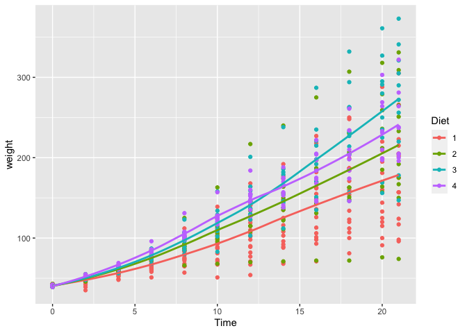
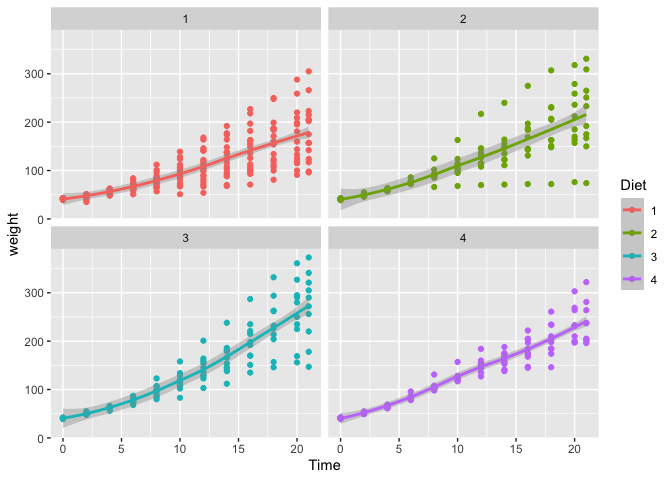
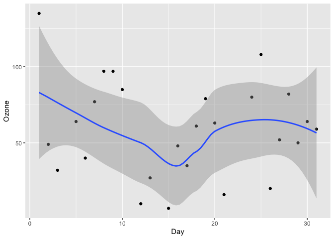
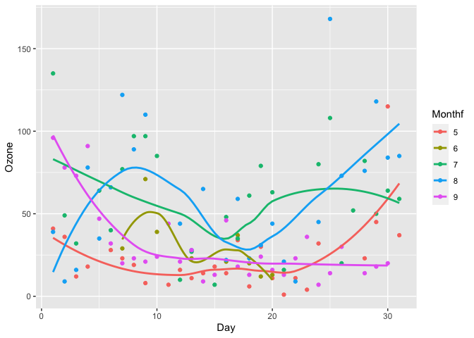
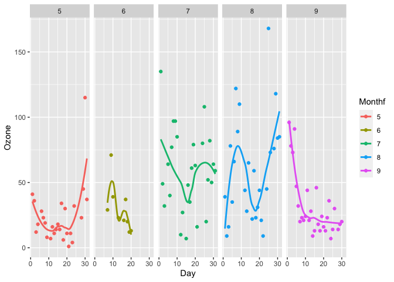
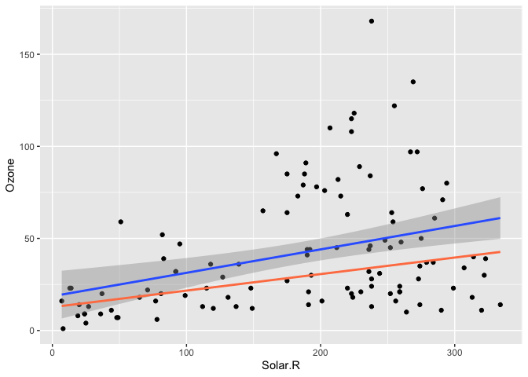
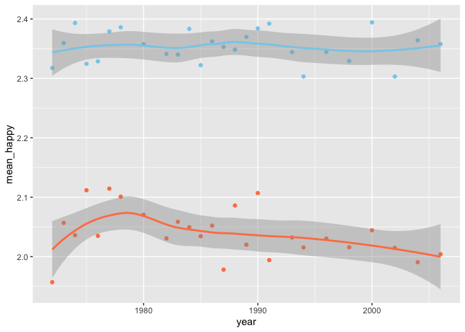

ggplot\_practice
================

오늘 할 일: r 내장 데이터 아무거나 무작위로 추출해서 적절하게 시각화를 해볼겁니다

## ChickWeight

``` r
library(ggplot2)
```

    ## Registered S3 methods overwritten by 'tibble':
    ##   method     from  
    ##   format.tbl pillar
    ##   print.tbl  pillar

``` r
library(dplyr)
```

    ## Warning: package 'dplyr' was built under R version 4.0.5

    ## 
    ## Attaching package: 'dplyr'

    ## The following objects are masked from 'package:stats':
    ## 
    ##     filter, lag

    ## The following objects are masked from 'package:base':
    ## 
    ##     intersect, setdiff, setequal, union

``` r
data("ChickWeight")
summary(ChickWeight)
```

    ##      weight           Time           Chick     Diet   
    ##  Min.   : 35.0   Min.   : 0.00   13     : 12   1:220  
    ##  1st Qu.: 63.0   1st Qu.: 4.00   9      : 12   2:120  
    ##  Median :103.0   Median :10.00   20     : 12   3:120  
    ##  Mean   :121.8   Mean   :10.72   10     : 12   4:118  
    ##  3rd Qu.:163.8   3rd Qu.:16.00   17     : 12          
    ##  Max.   :373.0   Max.   :21.00   19     : 12          
    ##                                  (Other):506

식이요법에 따른 병아리 몸무게 변화에 대한 자료… 시간은 4일 후부터 21일 후 까지 측정한 것 같다. 식이요법 종류는 총
4가지이고 병아리는 몇 마리냐면

``` r
unique(ChickWeight$Chick)
```

    ##  [1] 1  2  3  4  5  6  7  8  9  10 11 12 13 14 15 16 17 18 19 20 21 22 23 24 25
    ## [26] 26 27 28 29 30 31 32 33 34 35 36 37 38 39 40 41 42 43 44 45 46 47 48 49 50
    ## 50 Levels: 18 < 16 < 15 < 13 < 9 < 20 < 10 < 8 < 17 < 19 < 4 < 6 < 11 < ... < 48

50마리인가보다

``` r
ggplot(data=ChickWeight)+
  geom_point(mapping=aes(x=Time, y=weight, color=Diet))+
  geom_smooth(mapping=aes(x=Time, y=weight, color=Diet),se=F)
```

    ## `geom_smooth()` using method = 'loess' and formula 'y ~ x'

<!-- -->

3번 식이요법을 채택한 그룹이 가장 몸무게가 많이 나갔고… 1번이 제일 적게 보인다 시간이 지나면서 몸무게의 차이가 크게 나타나는
걸 봐서… 그냥 regression 적합을 시키면 어쩌면 등분산 가정 문제가 생길 수도 있을 것 같다

``` r
ggplot(data=ChickWeight)+
  geom_point(mapping=aes(x=Time, y=weight, color=Diet))+
  geom_smooth(mapping=aes(x=Time, y=weight, color=Diet))+
  facet_wrap(~ Diet)
```

    ## `geom_smooth()` using method = 'loess' and formula 'y ~ x'

<!-- -->

이거는 개별로 그려본거유 이렇게 보니까 별로 차이 없어보이는데… 그래도 그래프 기울기를 보면 1번 3번 차이가 많이 남

## Airquality

``` r
data("airquality")
head(airquality)
```

    ##   Ozone Solar.R Wind Temp Month Day
    ## 1    41     190  7.4   67     5   1
    ## 2    36     118  8.0   72     5   2
    ## 3    12     149 12.6   74     5   3
    ## 4    18     313 11.5   62     5   4
    ## 5    NA      NA 14.3   56     5   5
    ## 6    28      NA 14.9   66     5   6

``` r
unique(airquality$Month)
```

    ## [1] 5 6 7 8 9

또 어쩌다가 시계열 데이터를 잡았다 5월부터 9월까지 ozone 측정한 값이다 solar는 자외선 양인것 같다 근데 벌써 na가
보이는게 맘에 안든다 결측값이 얼마나 되는지 봐야겠다

``` r
colSums(is.na(airquality))
```

    ##   Ozone Solar.R    Wind    Temp   Month     Day 
    ##      37       7       0       0       0       0

37?? 전체 obs가 153인걸 고려하면 되게 많다 regression돌릴 때는 상당히 곤란할 수 있겠지만… 일단 시각화만
할거니까 결측치는 무시할 예정이다 아님 대충 회귀 돌려서 채워넣어도 될 것 같긴 한데 귀찮다 7월로 한번 그래프를
그려보는 걸로…

``` r
july<- filter(airquality, Month==7)
ggplot(data=july, mapping=aes(x=Day, y=Ozone))+
  geom_point()+
  geom_smooth()
```

    ## `geom_smooth()` using method = 'loess' and formula 'y ~ x'

    ## Warning: Removed 5 rows containing non-finite values (stat_smooth).

    ## Warning: Removed 5 rows containing missing values (geom_point).

<!-- -->

생각보다 그래프가 혼란스럽지 않다 … 겹쳐서 그려도 되겠는데

``` r
airquality$Monthf<-as.factor(airquality$Month)
ggplot(data=airquality)+
  geom_point(mapping=aes(x=Day, y=Ozone, color=Monthf))+
  geom_smooth(mapping=aes(x=Day, y=Ozone, color=Monthf), se=F)
```

    ## `geom_smooth()` using method = 'loess' and formula 'y ~ x'

    ## Warning: Removed 37 rows containing non-finite values (stat_smooth).

    ## Warning: Removed 37 rows containing missing values (geom_point).

<!-- -->

month를 정수로 인식하고 있어서 연속형으로 그래프를 그려주길래 factor 변수로 변환했다 근데…이게…최선인가? 이걸로 알 수
있는거? 8월말이랑…5월 말이 상당히 오존오존할 수 있겠구나 옆으로 한 번 더 그려봐야겠다

``` r
ggplot(data=airquality)+
  geom_point(mapping=aes(x=Day, y=Ozone, color=Monthf))+
  geom_smooth(mapping=aes(x=Day, y=Ozone, color=Monthf), se=F)+
  facet_wrap(~ Monthf, nrow=1)
```

    ## `geom_smooth()` using method = 'loess' and formula 'y ~ x'

    ## Warning: Removed 37 rows containing non-finite values (stat_smooth).

    ## Warning: Removed 37 rows containing missing values (geom_point).

<!-- -->

쬐끔 더 나아보이는 것 같기도 함 심심해서 적합도 한 번 시켜보기로함 다만… 시계열은 내가 못하기 때문에 x는 자외선으로 잡아보는
걸로

``` r
ggplot(data=airquality)+
  geom_point(mapping=aes(Solar.R,Ozone))+
  stat_smooth(method=lm, aes(Solar.R,Ozone))+
  stat_quantile(quantiles=c(0.5), aes(Solar.R,Ozone), color='coral', size=1)
```

    ## `geom_smooth()` using formula 'y ~ x'

    ## Warning: Removed 42 rows containing non-finite values (stat_smooth).

    ## Warning: Removed 42 rows containing non-finite values (stat_quantile).

    ## Smoothing formula not specified. Using: y ~ x

    ## Warning: Removed 42 rows containing missing values (geom_point).

<!-- --> 누가 봐도
등분산 가정 깨짐 진짜 어쩔 티비 그래서 median 활용해서 적합시켜봤음 쩌어 위에 outlier로 보이는 애들이 좀
있는데 그런거 감안했을 때 좀 더 안정적으로 적합시킨 것 같음 이거를 활용하면 아까 그 6월의 빈값도 좀 채울 수 있을 것
같지만 데이터도 적고 \~

``` r
cor.test(airquality$Ozone, airquality$Solar.R)
```

    ## 
    ##  Pearson's product-moment correlation
    ## 
    ## data:  airquality$Ozone and airquality$Solar.R
    ## t = 3.8798, df = 109, p-value = 0.0001793
    ## alternative hypothesis: true correlation is not equal to 0
    ## 95 percent confidence interval:
    ##  0.173194 0.502132
    ## sample estimates:
    ##       cor 
    ## 0.3483417

cor은 …나름 의미있는 결과라고 뜨네요

데이터 하나만 더 해보는 걸로 합시다

## Happy

``` r
library(GGally)
```

    ## Registered S3 method overwritten by 'GGally':
    ##   method from   
    ##   +.gg   ggplot2

``` r
head(happy)
```

    ##   id         happy year age    sex       marital         degree       finrela
    ## 1  1 not too happy 1972  23 female never married       bachelor       average
    ## 2  2 not too happy 1972  70   male       married lt high school above average
    ## 3  3  pretty happy 1972  48 female       married    high school       average
    ## 4  4 not too happy 1972  27 female       married       bachelor       average
    ## 5  5  pretty happy 1972  61 female       married    high school above average
    ## 6  6  pretty happy 1972  26   male never married    high school above average
    ##      health wtssall
    ## 1      good  0.4446
    ## 2      fair  0.8893
    ## 3 excellent  0.8893
    ## 4      good  0.8893
    ## 5      good  0.8893
    ## 6      good  0.4446

``` r
unique(happy$year)
```

    ##  [1] 1972 1973 1974 1975 1976 1977 1978 1980 1982 1983 1984 1985 1986 1987 1988
    ## [16] 1989 1990 1991 1993 1994 1996 1998 2000 2002 2004 2006

그러니까 정리하자면… 행복하냐? 물어본 내용이다 자료가 무지막지하게 많다 그래서 묶어서 볼거다

``` r
happy$happy<-as.character(happy$happy)
happy[happy=='not too happy']<-'1'
happy[happy=='pretty happy']<-'2'
happy[happy=='very happy']<-'3'
```

일단은 하기 전에 변수를 좀 변환해주어서 1,2,3으로 재코딩했다.

``` r
happy$happy<-as.integer(happy$happy)

hfin<-happy %>%
  filter(finrela=='far above'|finrela =='above average') %>%
  group_by(year) %>%
  summarize(
    mean_happy=mean(happy, na.rm=TRUE),
    count = n()) 

lfin<-happy %>%
  filter(finrela=='far below'|finrela =='below average') %>%
  group_by(year) %>%
  summarize(
    mean_happy=mean(happy, na.rm=TRUE),
    count = n()) 
```

재정관련 질문에 평균 이상인것 같다 라고 대답한 사람과 그렇지 않은 사람을 비교하기 위해서 다음과 같이 데이터를 쪼갰다.
group은 연도별로 설정해서 변화가 있나 살펴보기로 함

``` r
ggplot()+
  geom_point(data=hfin, aes(x=year, y=mean_happy), color='skyblue')+
  geom_point(data=lfin, aes(x=year, y=mean_happy), color='coral')+
  geom_smooth(data=hfin, aes(x=year, y=mean_happy), color='skyblue')+
  geom_smooth(data=lfin, aes(x=year, y=mean_happy), color='coral')
```

    ## `geom_smooth()` using method = 'loess' and formula 'y ~ x'
    ## `geom_smooth()` using method = 'loess' and formula 'y ~ x'

<!-- -->
이렇게…극명하게 차이가 나도 되는것인가? 당연히 파란색이 돈 많ㅇ다고 대답한 사람들이다 심지어 가난한
사람들은 미묘하지만 행복의 정도가 떨어지고 있는 것처럼 보인다… 이런 사실 극명한 정도까지는 아니다 그래도 조금씩 떨어지고 있는
것처럼 보임. cor 테스트 했을 때는 유의미하게 나온다. ㅠㅠ 다들 행복하세요
